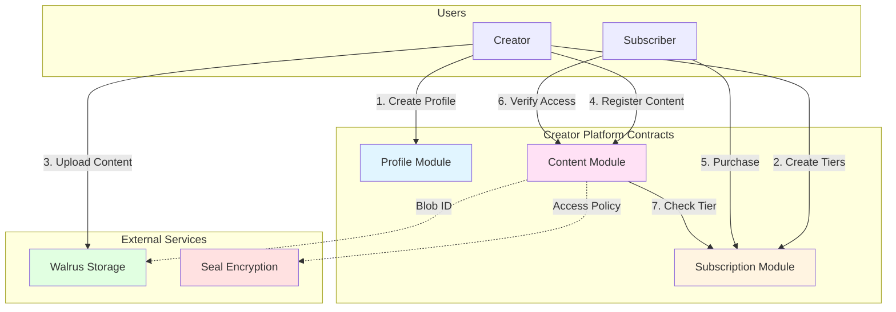
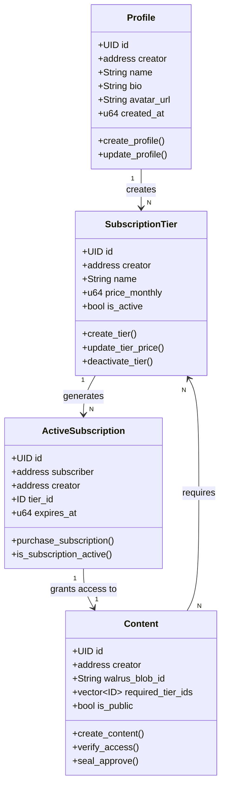
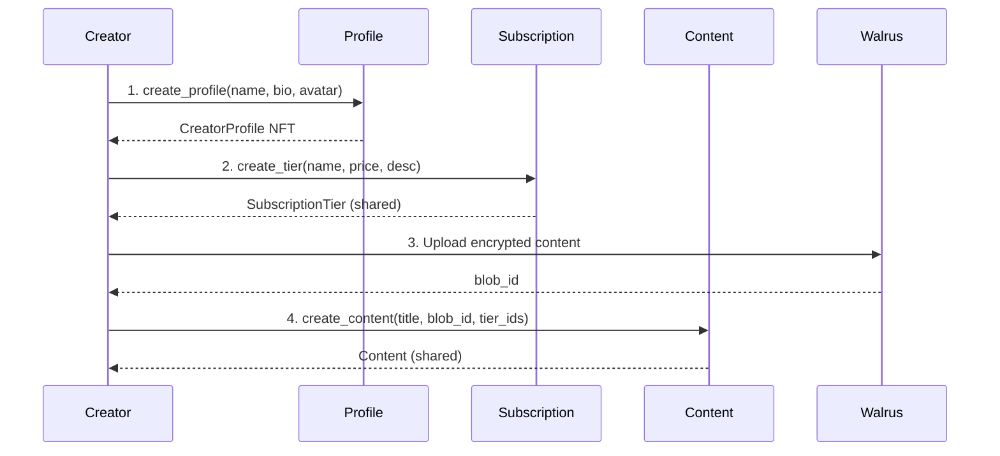
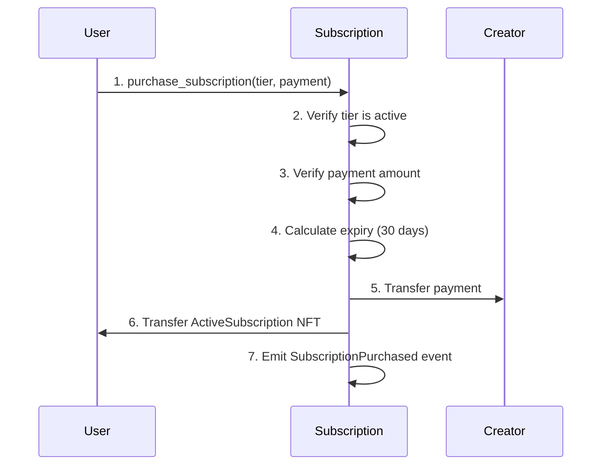
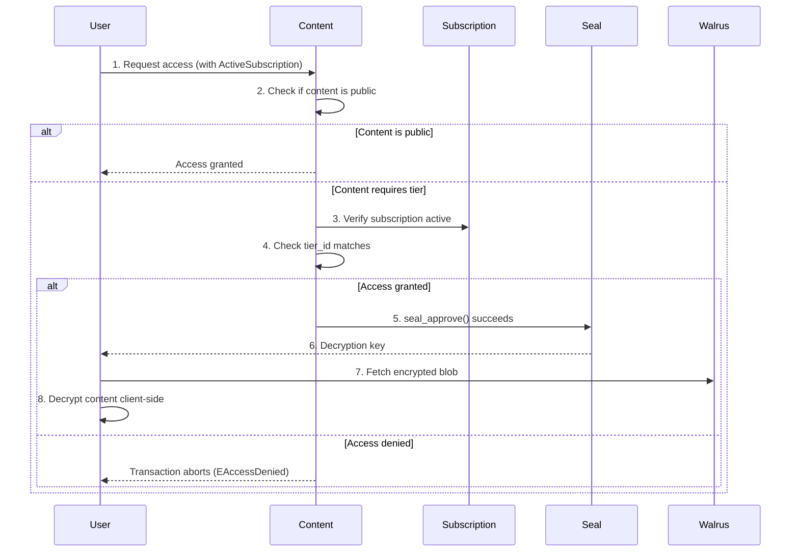
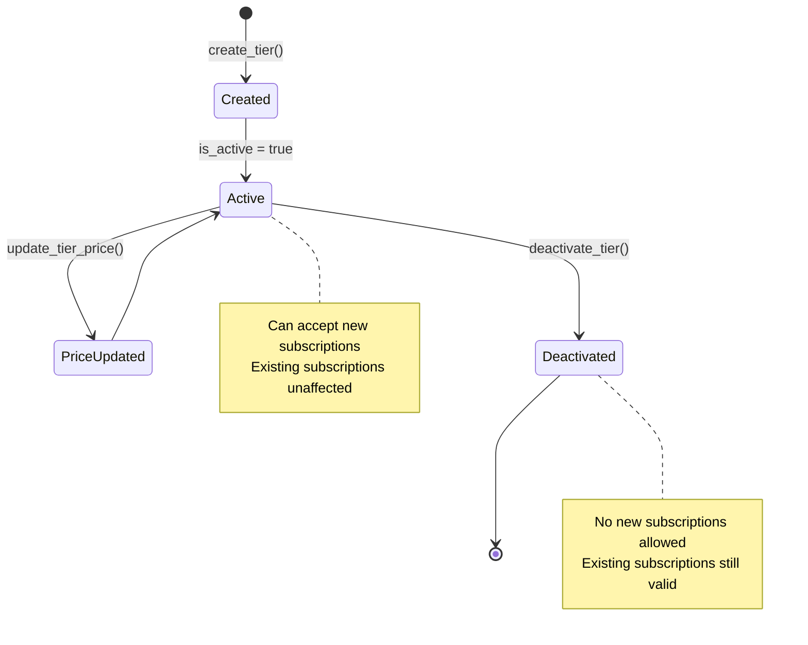

# Creator Platform - Sui Move Contracts

A decentralized creator subscription platform built on Sui blockchain, enabling creators to monetize content through tiered subscriptions with access control.

## 📋 Table of Contents

- [Overview](#overview)
- [Architecture](#architecture)
- [Modules](#modules)
- [Data Structures](#data-structures)
- [Key Flows](#key-flows)
- [Events](#events)
- [Integration Guide](#integration-guide)
- [Testing](#testing)
- [Deployment](#deployment)

## 🎯 Overview

The Creator Platform consists of three interconnected Move modules that work together to provide a complete subscription-based content platform:

- **Profile Module**: Creator identity and profile management
- **Subscription Module**: Tiered subscription system with payment processing
- **Content Module**: Content hosting with tier-based access control

### Key Features

✅ Creator profiles with metadata (name, bio, avatar)
✅ Flexible subscription tiers with custom pricing
✅ Automated 30-day subscription periods
✅ Tier-based content access control
✅ Integration-ready with Walrus (decentralized storage) and Seal (encryption)
✅ Event emission for off-chain indexing
✅ Programmable transaction support

## 🏗️ Architecture

### System Overview



### Module Relationships



## 📦 Modules

### 1. Profile Module (`profile.move`)

Manages creator identities on the platform.

#### Objects

**CreatorProfile** (has key, store)
- Represents a creator's identity
- Owned by the creator (NFT)
- Stores profile metadata

#### Core Functions

| Function | Visibility | Description |
|----------|-----------|-------------|
| `create_profile()` | public | Creates a new creator profile |
| `update_profile()` | public | Updates bio and avatar (owner-only) |
| `creator()` | public | Returns profile creator address |
| `name()` | public | Returns profile name |
| `bio()` | public | Returns profile bio |
| `avatar_url()` | public | Returns avatar URL |

#### Error Codes

- `ENotOwner (0)`: Caller is not the profile owner
- `EInvalidName (1)`: Profile name is empty

---

### 2. Subscription Module (`subscription.move`)

Implements the subscription tier system and payment processing.

#### Objects

**SubscriptionTier** (has key, store)
- Defines a subscription level
- Can be shared or owned
- Stores pricing and access rules

**ActiveSubscription** (has key, store)
- Represents an active subscription (NFT)
- Owned by the subscriber
- Contains expiration timestamp

#### Core Functions

| Function | Visibility | Description |
|----------|-----------|-------------|
| `create_tier()` | public | Creates a new subscription tier |
| `update_tier_price()` | public | Updates tier pricing (creator-only) |
| `deactivate_tier()` | public | Deactivates a tier (creator-only) |
| `purchase_subscription()` | entry | Purchases a subscription (30-day duration) |
| `is_subscription_active()` | public | Checks if subscription is not expired |

#### Constants

```move
MIST_PER_SUI = 1_000_000_000
MILLISECONDS_PER_DAY = 86_400_000
SUBSCRIPTION_DURATION_DAYS = 30
```

#### Helper Functions

- `sui_to_mist()`: Converts SUI to MIST
- `mist_to_sui()`: Converts MIST to SUI (rounds down)

#### Error Codes

- `ENotCreator (0)`: Caller is not the tier creator
- `EInvalidPrice (1)`: Price is zero or invalid
- `ETierInactive (2)`: Tier is deactivated
- `EInvalidName (3)`: Tier name is empty
- `EInsufficientPayment (4)`: Payment amount too low

---

### 3. Content Module (`content.move`)

Manages content metadata and tier-based access control.

#### Objects

**Content** (has key)
- Shared object for public metadata viewing
- Contains Walrus blob IDs
- Defines access requirements

#### Core Functions

| Function | Visibility | Description |
|----------|-----------|-------------|
| `create_content()` | entry | Registers new content with Walrus blob IDs |
| `verify_access()` | public | Checks if subscription grants access |
| `seal_approve()` | entry | Entry point for Seal decryption approval |

#### Access Control Logic

```move
verify_access() returns true if:
  - Content is public, OR
  - Subscription is active AND tier matches requirements
```

#### Error Codes

- `EAccessDenied (0)`: Subscription does not grant access

## 📊 Data Structures

### CreatorProfile

```move
struct CreatorProfile has key, store {
    id: UID,
    creator: address,        // Profile owner
    name: String,            // Display name
    bio: String,             // Creator bio
    avatar_url: String,      // Avatar image URL
    created_at: u64,         // Creation timestamp (ms)
}
```

### SubscriptionTier

```move
struct SubscriptionTier has key, store {
    id: UID,
    creator: address,        // Tier creator
    name: String,            // Tier name (e.g., "Gold", "Premium")
    description: String,     // Tier benefits
    price_monthly: u64,      // Price in MIST (1 SUI = 1B MIST)
    is_active: bool,         // Can accept new subscriptions
    created_at: u64,         // Creation timestamp (ms)
}
```

### ActiveSubscription

```move
struct ActiveSubscription has key, store {
    id: UID,
    subscriber: address,     // Subscription owner
    creator: address,        // Content creator
    tier_id: ID,             // Linked tier
    tier_name: String,       // Cached tier name
    started_at: u64,         // Subscription start (ms)
    expires_at: u64,         // Expiration timestamp (ms)
}
```

### Content

```move
struct Content has key {
    id: UID,
    creator: address,              // Content creator
    title: String,                 // Content title
    description: String,           // Content description
    content_type: String,          // MIME type (e.g., "video/mp4")
    walrus_blob_id: String,        // Main content blob ID
    preview_blob_id: String,       // Preview blob ID (optional)
    required_tier_ids: vector<ID>, // Tiers with access (empty = public)
    created_at: u64,               // Creation timestamp (ms)
    is_public: bool,               // Public access flag
}
```

## 🔄 Key Flows

### Creator Onboarding Flow



### Subscription Purchase Flow



### Content Access Verification Flow



### Tier Management Flow



## 📢 Events

All events are emitted for off-chain indexing and frontend updates.

### Profile Events

```move
struct ProfileCreated has copy, drop {
    profile_id: ID,
    creator: address,
    name: String,
    timestamp: u64,
}

struct ProfileUpdated has copy, drop {
    profile_id: ID,
    timestamp: u64,
}
```

### Subscription Events

```move
struct TierCreated has copy, drop {
    tier_id: ID,
    creator: address,
    name: String,
    price: u64,
}

struct TierPriceUpdated has copy, drop {
    tier_id: ID,
    old_price: u64,
    new_price: u64,
    timestamp: u64,
}

struct TierDeactivated has copy, drop {
    tier_id: ID,
    timestamp: u64,
}

struct SubscriptionPurchased has copy, drop {
    subscription_id: ID,
    subscriber: address,
    creator: address,
    tier_id: ID,
    amount: u64,
    expires_at: u64,
}
```

### Content Events

```move
struct ContentCreated has copy, drop {
    content_id: ID,
    creator: address,
    title: String,
    tier_ids: vector<ID>,
}
```

## 🔌 Integration Guide

### TypeScript Integration Example

```typescript
import { SuiClient, getFullnodeUrl } from '@mysten/sui.js/client';
import { TransactionBlock } from '@mysten/sui.js/transactions';
import { Ed25519Keypair } from '@mysten/sui.js/keypairs/ed25519';

// Initialize Sui client
const client = new SuiClient({
  url: getFullnodeUrl('testnet') // or 'mainnet'
});

const PACKAGE_ID = '0x...'; // Deployed package ID

// Create a creator profile
async function createProfile(
  keypair: Ed25519Keypair,
  name: string,
  bio: string,
  avatarUrl: string
) {
  const tx = new TransactionBlock();

  const profile = tx.moveCall({
    target: `${PACKAGE_ID}::profile::create_profile`,
    arguments: [
      tx.pure(name),
      tx.pure(bio),
      tx.pure(avatarUrl),
    ],
  });

  // Transfer profile to sender
  tx.transferObjects([profile], tx.pure(keypair.getPublicKey().toSuiAddress()));

  const result = await client.signAndExecuteTransactionBlock({
    signer: keypair,
    transactionBlock: tx,
  });

  return result;
}

// Create a subscription tier
async function createTier(
  keypair: Ed25519Keypair,
  name: string,
  description: string,
  priceInSui: number
) {
  const tx = new TransactionBlock();

  const priceInMist = priceInSui * 1_000_000_000;

  const tier = tx.moveCall({
    target: `${PACKAGE_ID}::subscription::create_tier`,
    arguments: [
      tx.pure(name),
      tx.pure(description),
      tx.pure(priceInMist),
    ],
  });

  // Share tier to allow public access
  tx.moveCall({
    target: '0x2::transfer::public_share_object',
    arguments: [tier],
  });

  const result = await client.signAndExecuteTransactionBlock({
    signer: keypair,
    transactionBlock: tx,
  });

  return result;
}

// Purchase a subscription
async function purchaseSubscription(
  keypair: Ed25519Keypair,
  tierId: string,
  paymentCoin: string
) {
  const tx = new TransactionBlock();

  tx.moveCall({
    target: `${PACKAGE_ID}::subscription::purchase_subscription`,
    arguments: [
      tx.object(tierId),
      tx.object(paymentCoin),
    ],
  });

  const result = await client.signAndExecuteTransactionBlock({
    signer: keypair,
    transactionBlock: tx,
  });

  return result;
}

// Create content
async function createContent(
  keypair: Ed25519Keypair,
  title: string,
  description: string,
  contentType: string,
  walrusBlobId: string,
  previewBlobId: string,
  requiredTierIds: string[],
  isPublic: boolean
) {
  const tx = new TransactionBlock();

  tx.moveCall({
    target: `${PACKAGE_ID}::content::create_content`,
    arguments: [
      tx.pure(title),
      tx.pure(description),
      tx.pure(contentType),
      tx.pure(walrusBlobId),
      tx.pure(previewBlobId),
      tx.pure(requiredTierIds),
      tx.pure(isPublic),
    ],
  });

  const result = await client.signAndExecuteTransactionBlock({
    signer: keypair,
    transactionBlock: tx,
  });

  return result;
}

// Verify access for content (seal_approve)
async function verifyAccess(
  keypair: Ed25519Keypair,
  contentId: string,
  subscriptionId: string
) {
  const tx = new TransactionBlock();

  tx.moveCall({
    target: `${PACKAGE_ID}::content::seal_approve`,
    arguments: [
      tx.object(contentId),
      tx.object(subscriptionId),
    ],
  });

  const result = await client.signAndExecuteTransactionBlock({
    signer: keypair,
    transactionBlock: tx,
  });

  return result;
}
```

### Query Objects

```typescript
// Get creator profiles by owner
async function getCreatorProfile(address: string) {
  const objects = await client.getOwnedObjects({
    owner: address,
    filter: {
      StructType: `${PACKAGE_ID}::profile::CreatorProfile`
    }
  });

  return objects;
}

// Get active subscriptions by owner
async function getActiveSubscriptions(address: string) {
  const objects = await client.getOwnedObjects({
    owner: address,
    filter: {
      StructType: `${PACKAGE_ID}::subscription::ActiveSubscription`
    }
  });

  return objects;
}

// Subscribe to profile creation events
async function subscribeToProfileEvents() {
  const unsubscribe = await client.subscribeEvent({
    filter: {
      MoveEventType: `${PACKAGE_ID}::profile::ProfileCreated`
    },
    onMessage: (event) => {
      console.log('New profile created:', event);
    }
  });

  return unsubscribe;
}

// Subscribe to subscription purchase events
async function subscribeToSubscriptionEvents() {
  const unsubscribe = await client.subscribeEvent({
    filter: {
      MoveEventType: `${PACKAGE_ID}::subscription::SubscriptionPurchased`
    },
    onMessage: (event) => {
      console.log('New subscription purchased:', event);
    }
  });

  return unsubscribe;
}
```

## 🧪 Testing

### Running Tests

```bash
# Run all tests
sui move test

# Run specific module tests
sui move test --filter profile
sui move test --filter subscription
sui move test --filter content

# Run with verbose output
sui move test -v
```

### Test Files

- `tests/profile_tests.move` - Profile module tests
- `tests/subscription_tests.move` - Subscription module tests
- `tests/content_tests.move` - Content module tests

### Test Coverage

The test suite covers:
- ✅ Profile creation and updates
- ✅ Subscription tier creation and management
- ✅ Subscription purchase flow
- ✅ Payment validation
- ✅ Access control verification
- ✅ Time-based expiration logic
- ✅ Error handling for all failure cases

## 🚀 Deployment

### Prerequisites

- Sui CLI installed (`sui --version`)
- Testnet/Mainnet address with SUI tokens
- Environment configured (`sui client active-env`)

### Build

```bash
cd contracts/creator_platform
sui move build
```

### Deploy to Testnet

```bash
sui client publish --gas-budget 100000000
```

### Deploy to Mainnet

```bash
sui client switch --env mainnet
sui client publish --gas-budget 100000000
```

### Post-Deployment

1. Save the package ID from deployment output
2. Update frontend/backend with new package ID
3. Verify deployment on [Sui Explorer](https://suiscan.xyz/)
4. Test all functions with integration tests

### Upgrade Strategy

Since Move objects are immutable after deployment:
- Plan upgrades carefully
- Use capability-based patterns for admin functions
- Consider using shared objects for upgradeable components
- Maintain backward compatibility with existing objects

## 📝 Best Practices

### For Creators

1. **Profile First**: Create your profile before creating tiers
2. **Test Pricing**: Start with lower prices and adjust based on demand
3. **Tier Naming**: Use clear, descriptive tier names (e.g., "Basic", "Premium", "VIP")
4. **Content Metadata**: Provide accurate content_type for proper frontend rendering
5. **Preview Content**: Always provide preview_blob_id for public samples

### For Subscribers

1. **Check Expiration**: Monitor subscription expiry dates
2. **Verify Tier**: Ensure tier grants access to desired content
3. **Renew Early**: Purchase new subscription before expiration

### For Integrators

1. **Event Indexing**: Subscribe to all events for real-time updates
2. **Object Caching**: Cache frequently accessed objects
3. **Error Handling**: Handle all abort codes gracefully
4. **Gas Optimization**: Use programmable transactions to batch operations
5. **Time Handling**: Always use `ctx.epoch_timestamp_ms()` for consistency

## 🔐 Security Considerations

1. **Access Control**: All ownership checks use `assert!` to prevent unauthorized access
2. **Payment Validation**: Subscription purchase validates payment amount
3. **Time-Based Access**: Subscriptions automatically expire based on timestamps
4. **Creator Control**: Only creators can modify their tiers and content
5. **Immutable Objects**: Critical data is immutable after creation

## 📚 Additional Resources

- [Sui Move Documentation](https://docs.sui.io/concepts/sui-move-concepts)
- [Sui TypeScript SDK](https://sdk.mystenlabs.com/typescript)
- [Walrus Storage Integration](https://docs.walrus.site/)
- [Seal Encryption](https://docs.mystenlabs.com/seal)

## 📄 License

[Specify your license here]

## 🤝 Contributing

[Add contribution guidelines if applicable]

---

**Built with ❤️ on Sui Blockchain**
