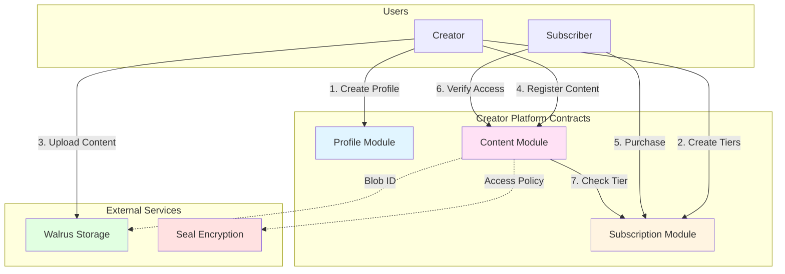
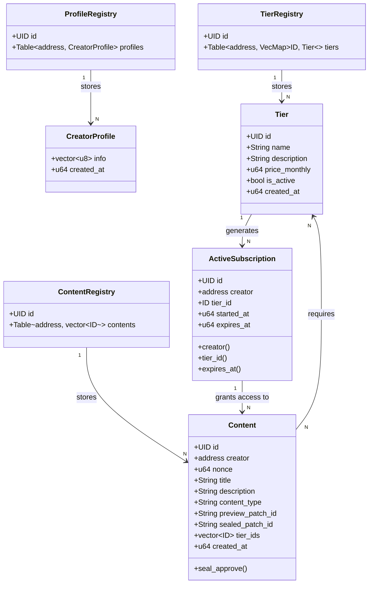
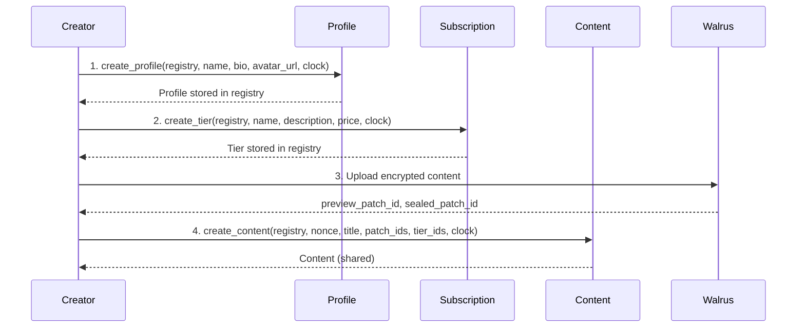
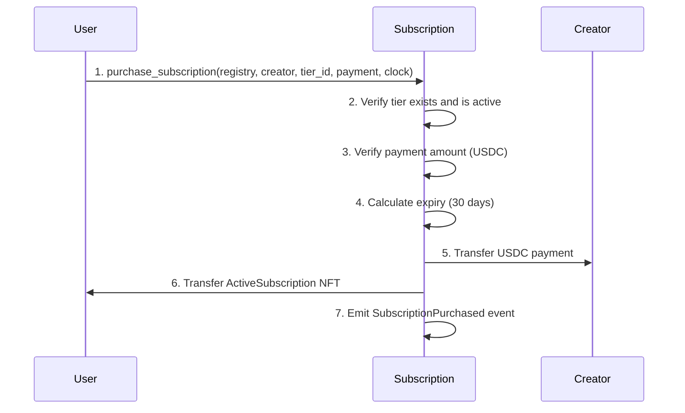
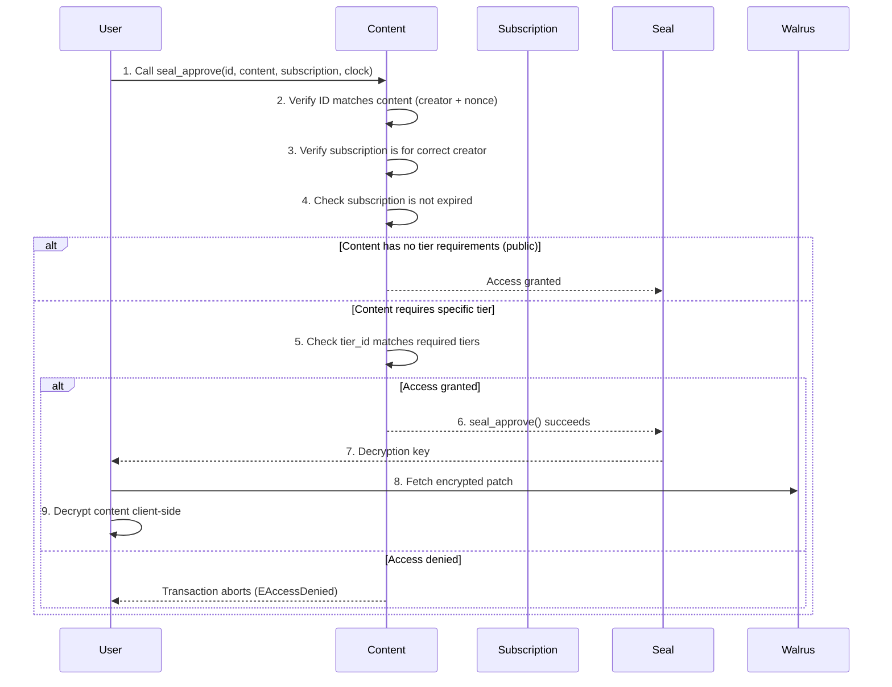
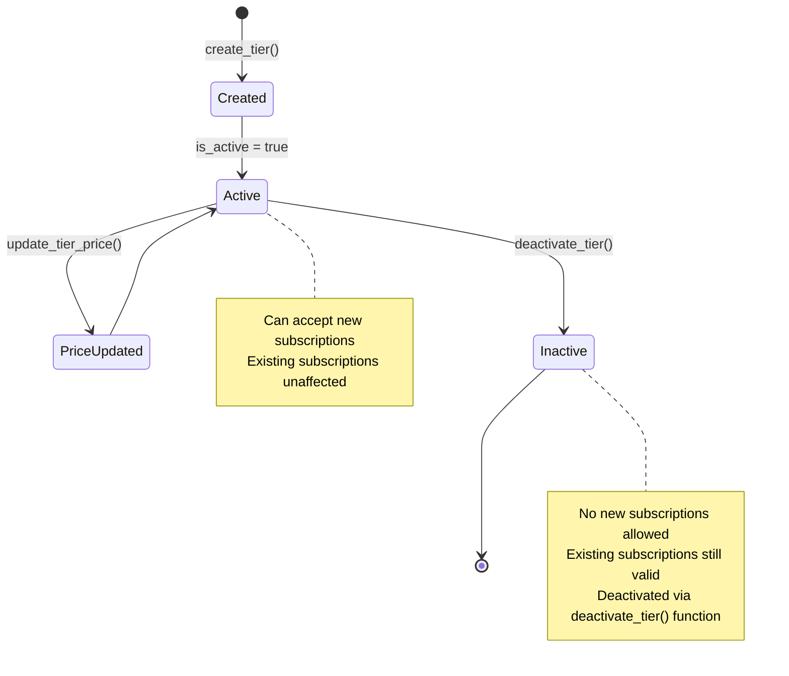

# Creator Platform - Sui Move Contracts

A decentralized creator subscription platform built on Sui blockchain, enabling creators to monetize content through tiered subscriptions with access control.

## 🆕 Recent Updates

### Latest Changes (2025-11-20)
- ✅ **Added background_url field**: Creator profiles now support background/banner images
- ✅ **Updated ProfileCreated event**: Includes `background_url` field for complete indexing
- ✅ **Updated ProfileUpdated event**: Includes `background_url` field
- ✅ **New view function**: `background_url()` for querying background images
- ✅ **Breaking change**: `create_profile()` and `update_profile()` now require `background_url` parameter

### Previous Updates (2025-11-19)
- ✅ **Reverted to explicit profile fields**: Changed from `info: vector<u8>` to structured fields (`name`, `bio`, `avatar_url`, `created_at`)
- ✅ **Complete event data**: `ProfileCreated` now includes ALL profile fields (bio, avatar_url) for off-chain indexing
- ✅ **Enhanced events**: `ProfileUpdated` includes all updated profile data
- ✅ **Added view functions**: `name()`, `bio()`, `avatar_url()`, `created_at()` for querying profile data

### Subscription Module Changes
- ✅ **Added tier deactivation**: New `deactivate_tier()` function allows creators to disable tiers
- ✅ **Added TierDeactivated event**: Emitted when a tier is deactivated
- ✅ **Enhanced TierCreated event**: Includes `description`, `is_active`, and `created_at` fields for complete indexing
- ✅ **Enhanced TierPriceUpdated event**: Now includes `creator` and `timestamp` for complete indexing
- ✅ **Enhanced SubscriptionPurchased event**: Includes `tier_name` and `started_at` to avoid tier lookups in indexer

### Content Module Changes
- ✅ **Field naming consistency**: Using `sealed_patch_id` and `preview_patch_id` (aligned with Walrus terminology)
- ✅ **Simplified public content**: `is_public` removed from events, derived from `tier_ids.length === 0`

### Design Principle: Complete Event Data
⚠️ **All events include complete data** - Events contain ALL necessary fields for off-chain indexing without requiring additional on-chain queries

### Breaking Changes
⚠️ **Event structures have changed** - Backend indexers must parse additional fields
⚠️ **Profile creation API changed** - Now requires individual parameters instead of encoded bytes
⚠️ **TierPriceUpdated signature changed** - Now requires `clock` parameter

See [Migration Summary](../../backend/MIGRATION_SUMMARY.md) for detailed migration guide.

---

## 📋 Table of Contents

- [Overview](#overview)
- [Architecture](#architecture)
- [Modules](#modules)
- [Data Structures](#data-structures)
- [Key Flows](#key-flows)
- [Events](#events)
- [Integration Guide](#integration-guide)
- [Testing](#testing)
- [Deployment](#deployment)

## 🎯 Overview

The Creator Platform consists of three interconnected Move modules that work together to provide a complete subscription-based content platform:

- **Profile Module**: Creator identity and profile management using a shared registry
- **Subscription Module**: Tiered subscription system with USDC payment processing
- **Content Module**: Content hosting with tier-based access control and Seal integration

### Key Features

✅ Creator profiles stored in a shared registry
✅ Flexible subscription tiers with custom USDC pricing
✅ Automated 30-day subscription periods
✅ Tier-based content access control via Seal
✅ Integration with Walrus (decentralized storage via patches)
✅ Integration with Seal (encryption and access policy verification)
✅ Event emission for off-chain indexing
✅ Programmable transaction support
✅ Gas-efficient registry-based architecture

## 🏗️ Architecture

### System Overview



### Module Relationships



## 📦 Modules

### 1. Profile Module (`profile.move`)

Manages creator identities on the platform.

#### Objects

**ProfileRegistry** (has key)
- Shared object storing all creator profiles
- Maps creator addresses to their profiles

**CreatorProfile** (has store)
- Represents a creator's identity
- Stored in the registry
- Contains explicit profile fields: name, bio, avatar_url, created_at

#### Core Functions

| Function | Visibility | Description |
|----------|-----------|-------------|
| `create_profile()` | public | Creates a new creator profile with name, bio, avatar_url, background_url |
| `update_profile()` | public | Updates profile fields: name, bio, avatar_url, background_url (owner-only) |
| `name()` | public | Returns creator's name |
| `bio()` | public | Returns creator's bio |
| `avatar_url()` | public | Returns creator's avatar URL |
| `background_url()` | public | Returns creator's background URL |
| `created_at()` | public | Returns profile creation timestamp |

#### Error Codes

- `EProfileAlreadyExists (0)`: Profile already exists for this creator
- `EProfileNotFound (1)`: Profile not found in registry
- `EInvalidName (2)`: Profile name is empty

---

### 2. Subscription Module (`subscription.move`)

Implements the subscription tier system and payment processing.

#### Objects

**TierRegistry** (has key)
- Shared object storing all subscription tiers
- Maps creator addresses to their tiers (VecMap of tier ID to Tier)

**Tier** (has key, store)
- Defines a subscription level
- Stored in the registry
- Stores pricing and access rules

**ActiveSubscription** (has key)
- Represents an active subscription (NFT)
- Owned by the subscriber
- Contains expiration timestamp

#### Core Functions

| Function | Visibility | Description |
|----------|-----------|-------------|
| `create_tier()` | public | Creates a new subscription tier in the registry |
| `update_tier_price()` | public | Updates tier pricing (creator-only) |
| `deactivate_tier()` | public | Deactivates a tier (creator-only) - prevents new subscriptions |
| `purchase_subscription()` | public | Purchases a subscription (30-day duration) |
| `creator()` | public | Returns subscription creator address |
| `tier_id()` | public | Returns subscription tier ID |
| `expires_at()` | public | Returns subscription expiration timestamp |

#### Constants

```move
MILLISECONDS_PER_DAY = 86_400_000
SUBSCRIPTION_DURATION_DAYS = 30
```

#### Error Codes

- `ENotCreator (0)`: Caller is not the tier creator
- `ETierNotFound (1)`: Tier not found in registry
- `EInvalidPrice (2)`: Price is zero or invalid
- `ETierInactive (3)`: Tier is deactivated
- `EInvalidName (4)`: Tier name is empty
- `EInsufficientFunds (5)`: Payment amount too low

#### Payment

- Uses USDC tokens for subscription payments
- Payments are transferred directly to the creator

---

### 3. Content Module (`content.move`)

Manages content metadata and tier-based access control.

#### Objects

**ContentRegistry** (has key)
- Shared object storing all content metadata
- Maps creator addresses to their content IDs

**Content** (has key)
- Shared object for public metadata viewing
- Contains Walrus patch IDs (preview and sealed)
- Defines access requirements via tier IDs
- Includes nonce for unique identification

#### Core Functions

| Function | Visibility | Description |
|----------|-----------|-------------|
| `create_content()` | public | Registers new content with Walrus patch IDs |
| `seal_approve()` | entry | Entry point for Seal decryption approval |
| `check_policy()` | private | Internal function to verify access |

#### Access Control Logic

```move
check_policy() returns true if:
  - ID matches content creator and nonce, AND
  - Subscription is for the correct creator, AND
  - Subscription is not expired, AND
  - (Content has no tier requirements OR subscription tier is in required tiers)
```

#### Error Codes

- `EAccessDenied (0)`: Subscription does not grant access

## 📊 Data Structures

### ProfileRegistry

```move
public struct ProfileRegistry has key {
    id: UID,
    profiles: Table<address, CreatorProfile>,
}
```

### CreatorProfile

```move
public struct CreatorProfile has store {
    name: String,            // Creator name (e.g., "alice.sui")
    bio: String,             // Creator bio/description
    avatar_url: String,      // Avatar image URL
    background_url: String,  // Background/banner image URL
    created_at: u64,         // Creation timestamp (ms)
}
```

### TierRegistry

```move
public struct TierRegistry has key {
    id: UID,
    tiers: Table<address, VecMap<ID, Tier>>,
}
```

### Tier

```move
public struct Tier has key, store {
    id: UID,
    name: String,            // Tier name (e.g., "Gold", "Premium")
    description: String,     // Tier benefits
    price_monthly: u64,      // Price in USDC
    is_active: bool,         // Can accept new subscriptions
    created_at: u64,         // Creation timestamp (ms)
}
```

### ActiveSubscription

```move
public struct ActiveSubscription has key {
    id: UID,
    creator: address,        // Content creator
    tier_id: ID,             // Linked tier
    started_at: u64,         // Subscription start (ms)
    expires_at: u64,         // Expiration timestamp (ms)
}
```

### ContentRegistry

```move
public struct ContentRegistry has key {
    id: UID,
    contents: Table<address, vector<ID>>,
}
```

### Content

```move
public struct Content has key {
    id: UID,
    creator: address,              // Content creator
    nonce: u64,                    // Unique nonce for identification
    title: String,                 // Content title
    description: String,           // Content description
    content_type: String,          // MIME type (e.g., "video/mp4")
    preview_patch_id: String,      // Preview patch ID in Walrus
    sealed_patch_id: String,       // Sealed patch ID in Walrus
    tier_ids: vector<ID>,          // Tiers with access (empty = public)
    created_at: u64,               // Creation timestamp (ms)
}
```

## 🔄 Key Flows

### Creator Onboarding Flow



### Subscription Purchase Flow



### Content Access Verification Flow



### Tier Management Flow



## 📢 Events

All events are emitted for off-chain indexing and frontend updates.

### Profile Events

```move
public struct ProfileCreated has copy, drop {
    profile_id: ID,
    creator: address,
    name: String,
    bio: String,           // Full profile data for indexing
    avatar_url: String,    // Full profile data for indexing
    background_url: String, // Full profile data for indexing
    timestamp: u64,
}

public struct ProfileUpdated has copy, drop {
    profile_id: ID,
    creator: address,
    name: String,
    bio: String,
    avatar_url: String,
    background_url: String,
    timestamp: u64,
}
```

### Subscription Events

```move
public struct TierCreated has copy, drop {
    tier_id: ID,
    creator: address,
    name: String,
    description: String,
    price: u64,
    is_active: bool,      // Always true on creation
    created_at: u64,
}

public struct TierPriceUpdated has copy, drop {
    tier_id: ID,
    creator: address,     // For indexing by creator
    old_price: u64,
    new_price: u64,
    timestamp: u64,       // When price was updated
}

public struct TierDeactivated has copy, drop {
    tier_id: ID,
    creator: address,
    timestamp: u64,
}

public struct SubscriptionPurchased has copy, drop {
    subscription_id: ID,
    subscriber: address,
    creator: address,
    tier_id: ID,
    tier_name: String,    // For easy reference without tier lookup
    amount: u64,
    started_at: u64,      // Subscription start timestamp
    expires_at: u64,      // Subscription end timestamp
}
```

### Content Events

```move
public struct ContentCreated has copy, drop {
    content_id: ID,
    creator: address,
    title: String,
    description: String,
    content_type: String,
    preview_patch_id: String,
    sealed_patch_id: String,
    tier_ids: vector<ID>,
    created_at: u64,
}
```

## 🔌 Integration Guide

### TypeScript Integration Example

```typescript
import { SuiClient, getFullnodeUrl } from '@mysten/sui.js/client';
import { TransactionBlock } from '@mysten/sui.js/transactions';
import { Ed25519Keypair } from '@mysten/sui.js/keypairs/ed25519';

// Initialize Sui client
const client = new SuiClient({
  url: getFullnodeUrl('testnet') // or 'mainnet'
});

const PACKAGE_ID = '0x...'; // Deployed package ID

// Create a creator profile
async function createProfile(
  keypair: Ed25519Keypair,
  profileRegistryId: string,
  clockId: string,
  name: string,
  bio: string,
  avatarUrl: string,
  backgroundUrl: string
) {
  const tx = new TransactionBlock();

  tx.moveCall({
    target: `${PACKAGE_ID}::profile::create_profile`,
    arguments: [
      tx.object(profileRegistryId),
      tx.pure(name),
      tx.pure(bio),
      tx.pure(avatarUrl),
      tx.pure(backgroundUrl),
      tx.object(clockId),
    ],
  });

  const result = await client.signAndExecuteTransactionBlock({
    signer: keypair,
    transactionBlock: tx,
  });

  return result;
}

// Create a subscription tier
async function createTier(
  keypair: Ed25519Keypair,
  tierRegistryId: string,
  clockId: string,
  name: string,
  description: string,
  priceInUsdc: number // Price in USDC (6 decimals)
) {
  const tx = new TransactionBlock();

  tx.moveCall({
    target: `${PACKAGE_ID}::subscription::create_tier`,
    arguments: [
      tx.object(tierRegistryId),
      tx.pure(name),
      tx.pure(description),
      tx.pure(priceInUsdc),
      tx.object(clockId),
    ],
  });

  const result = await client.signAndExecuteTransactionBlock({
    signer: keypair,
    transactionBlock: tx,
  });

  return result;
}

// Purchase a subscription
async function purchaseSubscription(
  keypair: Ed25519Keypair,
  tierRegistryId: string,
  clockId: string,
  creatorAddress: string,
  tierId: string,
  paymentCoin: string // USDC coin object
) {
  const tx = new TransactionBlock();

  tx.moveCall({
    target: `${PACKAGE_ID}::subscription::purchase_subscription`,
    arguments: [
      tx.object(tierRegistryId),
      tx.pure(creatorAddress),
      tx.pure(tierId),
      tx.object(paymentCoin),
      tx.object(clockId),
    ],
  });

  const result = await client.signAndExecuteTransactionBlock({
    signer: keypair,
    transactionBlock: tx,
  });

  return result;
}

// Create content
async function createContent(
  keypair: Ed25519Keypair,
  contentRegistryId: string,
  clockId: string,
  nonce: number,
  title: string,
  description: string,
  contentType: string,
  previewPatchId: string,
  sealedPatchId: string,
  requiredTierIds: string[]
) {
  const tx = new TransactionBlock();

  tx.moveCall({
    target: `${PACKAGE_ID}::content::create_content`,
    arguments: [
      tx.object(contentRegistryId),
      tx.pure(nonce),
      tx.pure(title),
      tx.pure(description),
      tx.pure(contentType),
      tx.pure(previewPatchId),
      tx.pure(sealedPatchId),
      tx.pure(requiredTierIds),
      tx.object(clockId),
    ],
  });

  const result = await client.signAndExecuteTransactionBlock({
    signer: keypair,
    transactionBlock: tx,
  });

  return result;
}

// Verify access for content (seal_approve)
async function verifyAccess(
  keypair: Ed25519Keypair,
  clockId: string,
  contentId: string,
  subscriptionId: string,
  id: Uint8Array // BCS-encoded creator address and nonce
) {
  const tx = new TransactionBlock();

  tx.moveCall({
    target: `${PACKAGE_ID}::content::seal_approve`,
    arguments: [
      tx.pure(Array.from(id)),
      tx.object(contentId),
      tx.object(subscriptionId),
      tx.object(clockId),
    ],
  });

  const result = await client.signAndExecuteTransactionBlock({
    signer: keypair,
    transactionBlock: tx,
  });

  return result;
}
```

### Query Objects

```typescript
// Get profile registry (shared object)
async function getProfileRegistry() {
  // Query for ProfileRegistry shared object
  const result = await client.getObject({
    id: PROFILE_REGISTRY_ID, // Known registry object ID
    options: { showContent: true }
  });

  return result;
}

// Get creator profile from registry
async function getCreatorProfile(
  profileRegistryId: string,
  creatorAddress: string
) {
  // Query dynamic field for specific creator
  const result = await client.getDynamicFieldObject({
    parentId: profileRegistryId,
    name: {
      type: 'address',
      value: creatorAddress
    }
  });

  return result;
}

// Get active subscriptions owned by address
async function getActiveSubscriptions(address: string) {
  const objects = await client.getOwnedObjects({
    owner: address,
    filter: {
      StructType: `${PACKAGE_ID}::subscription::ActiveSubscription`
    },
    options: { showContent: true }
  });

  return objects;
}

// Get tier registry (shared object)
async function getTierRegistry() {
  const result = await client.getObject({
    id: TIER_REGISTRY_ID, // Known registry object ID
    options: { showContent: true }
  });

  return result;
}

// Subscribe to profile creation events
async function subscribeToProfileEvents() {
  const unsubscribe = await client.subscribeEvent({
    filter: {
      MoveEventType: `${PACKAGE_ID}::profile::ProfileCreated`
    },
    onMessage: (event) => {
      console.log('New profile created:', event);
    }
  });

  return unsubscribe;
}

// Subscribe to subscription purchase events
async function subscribeToSubscriptionEvents() {
  const unsubscribe = await client.subscribeEvent({
    filter: {
      MoveEventType: `${PACKAGE_ID}::subscription::SubscriptionPurchased`
    },
    onMessage: (event) => {
      console.log('New subscription purchased:', event);
    }
  });

  return unsubscribe;
}
```

## 🧪 Testing

### Running Tests

```bash
# Run all tests
sui move test

# Run specific module tests
sui move test --filter profile
sui move test --filter subscription
sui move test --filter content

# Run with verbose output
sui move test -v
```

### Test Files

- `tests/profile_tests.move` - Profile module tests
- `tests/subscription_tests.move` - Subscription module tests
- `tests/content_tests.move` - Content module tests

### Test Coverage

The test suite covers:
- ✅ Profile creation and updates
- ✅ Subscription tier creation and management
- ✅ Subscription purchase flow
- ✅ Payment validation
- ✅ Access control verification
- ✅ Time-based expiration logic
- ✅ Error handling for all failure cases

## 🚀 Deployment

### Prerequisites

- Sui CLI installed (`sui --version`)
- Testnet/Mainnet address with SUI tokens
- Environment configured (`sui client active-env`)

### Build

```bash
cd contracts/creator_platform
sui move build
```

### Deploy to Testnet

```bash
sui client publish --gas-budget 100000000
```

### Deploy to Mainnet

```bash
sui client switch --env mainnet
sui client publish --gas-budget 100000000
```

### Post-Deployment

1. Save the package ID from deployment output
2. Update frontend/backend with new package ID
3. Verify deployment on [Sui Explorer](https://suiscan.xyz/)
4. Test all functions with integration tests

### Upgrade Strategy

Since Move objects are immutable after deployment:
- Plan upgrades carefully
- Use capability-based patterns for admin functions
- Consider using shared objects for upgradeable components
- Maintain backward compatibility with existing objects

## 📝 Best Practices

### For Creators

1. **Profile First**: Create your profile before creating tiers
2. **Test Pricing**: Start with lower prices and adjust based on demand
3. **Tier Naming**: Use clear, descriptive tier names (e.g., "Basic", "Premium", "VIP")
4. **Content Metadata**: Provide accurate content_type for proper frontend rendering
5. **Preview Content**: Always provide preview_blob_id for public samples

### For Subscribers

1. **Check Expiration**: Monitor subscription expiry dates
2. **Verify Tier**: Ensure tier grants access to desired content
3. **Renew Early**: Purchase new subscription before expiration

### For Integrators

1. **Event Indexing**: Subscribe to all events for real-time updates
2. **Object Caching**: Cache frequently accessed objects
3. **Error Handling**: Handle all abort codes gracefully
4. **Gas Optimization**: Use programmable transactions to batch operations
5. **Time Handling**: Always use `ctx.epoch_timestamp_ms()` for consistency

## 🔐 Security Considerations

1. **Access Control**: All ownership checks use `assert!` to prevent unauthorized access
2. **Payment Validation**: Subscription purchase validates payment amount
3. **Time-Based Access**: Subscriptions automatically expire based on timestamps
4. **Creator Control**: Only creators can modify their tiers and content
5. **Immutable Objects**: Critical data is immutable after creation

## 📚 Additional Resources

- [Sui Move Documentation](https://docs.sui.io/concepts/sui-move-concepts)
- [Sui TypeScript SDK](https://sdk.mystenlabs.com/typescript)
- [Walrus Storage Integration](https://docs.wal.app/)
- [Seal Encryption](https://docs.mystenlabs.com/seal)

## 📄 License

[Specify your license here]

## 🤝 Contributing

[Add contribution guidelines if applicable]

---

**Built with ❤️ on Sui Blockchain**
